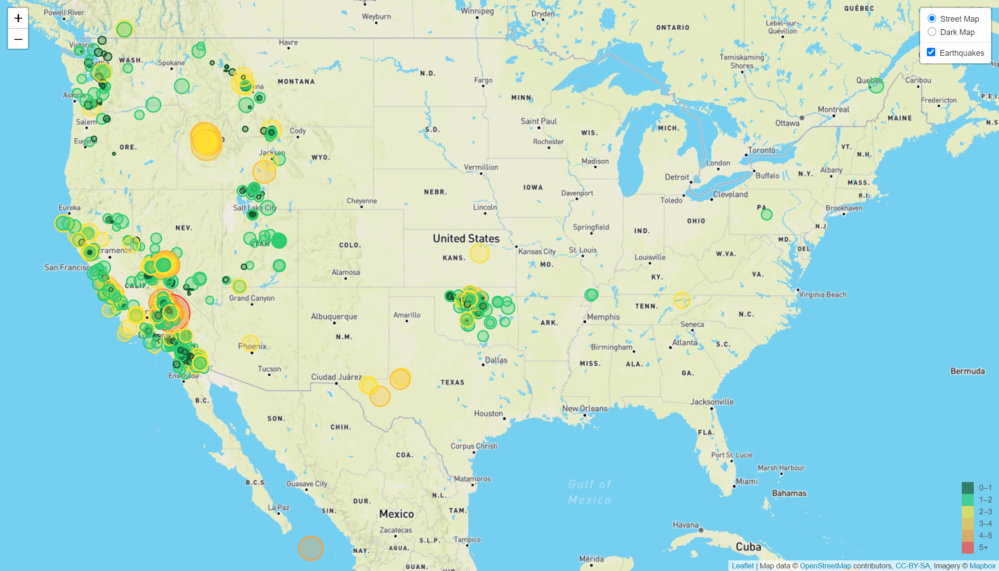

# leaflet-challenge

The visualization depicted below is an interactive map that displays earthquake data based upon all earthquakes from the past 7 days sourced from the United States Geological Survey (USGS) website (http://earthquake.usgs.gov/earthquakes/feed/v1.0/geojson), which is updated every 5 minutes. The USGS is responsible for providing scientific data about natural hazards, the health of our ecosystems and environment; and the impacts of climate and land-use change. Their scientists develop new methods and tools to supply timely, relevant, and useful information about the Earth and its processes. 

The USGS is interested in building a new set of tools that will allow them visualize their earthquake data. They collect a massive amount of data from all over the world each day, but they lack a meaningful way of displaying it. Their hope is that being able to visualize their data will allow them to better educate the public and other government organizations (and hopefully secure more funding..) on issues facing our planet.

As one might expect, the vast majority of earthquakes have occurred in California and along with its neighboring West coast states of Washington and Oregon in the past 7 days as of June 6, 2020.  There have been a cluster of earthquakes in Idaho, Wyoming, Utah, and Oklahoma.  The majority of earthquakes have a magnitude that is 2 or less.  However, the largest earthquake had a magnitude of 5.53 on June 3, 2020 at 20:32:11 GMT (Central Daylight Time) located at 17km S of Searles Valley, CA.

